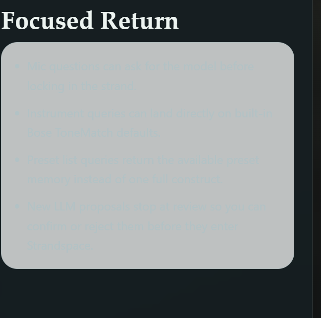
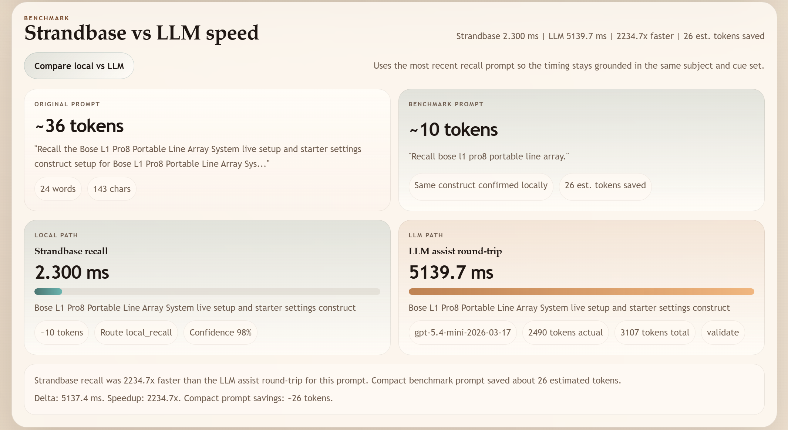
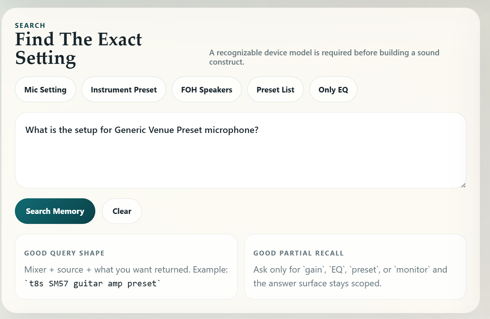

# Strandspace

[](https://nodejs.org/)
[](#license-status)
[](#why-strandspace)

Strandspace is a local-first recall workspace for reusable knowledge constructs. It ships with two focused modes:

- `Subjectspace` for structured capture and recall across a subject field
- `Soundspace` for mixer, preset, venue, and event-specific music engineering memory

The app prefers local recall first, uses OpenAI only when configured, and stays useful with no API key.

Prominent white paper links:

- [White paper (PDF)](./strandspace-white-paper.pdf)
- [White paper summary (Markdown)](./docs/white-paper-summary.md)

## Quick Start

```bash
npm install
cp .env.example .env
npm run dev
```

Open [http://localhost:3000](http://localhost:3000).

- Main construct builder: `/`
- Backend workspace: `/`
- Legacy `/studio` route now opens the backend workspace
- Soundspace / Music Engineer: `/soundspace`
- SQLite editor and DB size display live inside the backend data browser
- Recall Lab in the backend now loads a cleaner construct-title search and fills the matched construct back into the editor

If you do not set `OPENAI_API_KEY`, the app runs in local-only mode. Recall, library browsing, seed data, and construct editing still work; OpenAI assist and benchmark assist calls are simply disabled.

## Demo Screens

### Soundspace Query Guidance



### Benchmark View



### Query Composer



## Example Use Cases

### 1. Build a reusable construct from rough notes

Prompt:

```text
Subject: Music Engineering
Target: Lead vocal on Yamaha MG10XU
Objective: clear lead vocal with safe feedback margin
Context:
room: small club
source: wired cardioid vocal mic
Steps:
- Trim rumble before boosting presence
- Keep reverb subtle
```

### 2. Recall only the part you need

Prompt:

```text
t8s eq for handheld vocal
```

### 3. Ask for a missing mic-specific strand

Prompt:

```text
t8s shure mic setting
```

### 4. Compare local recall speed with API assist

Prompt:

```text
What is my festival stage scene recall habit?
```

## Why Strandspace?

| Strandspace local recall | Typical LLM-only recall |
| --- | --- |
| Reuses stored constructs with context, steps, notes, and tags | Rebuilds an answer from scratch every time |
| Works with no API key | Usually depends on a live model call |
| Can answer from partial cues and only return the requested section | Often returns a broad answer unless heavily prompted |
| Lets you extend and store improvements as memory | Improvements are easy to lose between chats |
| Makes latency visible with compare mode | Latency is usually hidden behind a single response |

Strandspace is especially useful when the answer should become better local memory after each pass instead of becoming another disconnected message.

## Configuration

Create `.env` from `.env.example`:

```env
# Optional - enables LLM assist and benchmarks
OPENAI_API_KEY=sk-...

# Optional - custom DB path
STRANDSPACE_DB_PATH=data/strandspace.sqlite
```

Notes:

- Default port is `3000`. Set `PORT` to override it.
- The selected SQLite path is logged at startup.
- OpenAI enabled/disabled state is logged at startup.
- `STRANDSPACE_LOG_LEVEL` can be set to `debug`, `info`, `warn`, or `error`.
- With no key, the UI falls back gracefully to local-only behavior.

## Scripts

```bash
npm run dev
npm run start
npm run test
npm run clean
npm run kill
npm run restart
```

What they do:

- `clean` removes the local Strandspace SQLite files and common local server logs
- `kill` stops project-related `node` / `npm` dev processes
- `restart` stops the current dev process and starts the server again

## Seeded Examples

The bundled examples include:

- music-engineering constructs for gain staging, signal flow, vocal chains, monitor mixes, feedback control, EQ troubleshooting, parallel compression, and scene recall habits
- venue presets for small club, festival stage, conference room, studio control room, and karaoke bar workflows

Use the `Reset with Examples` button in the UI to restore the demo library.

## Development Notes

- Local runtime state is stored in SQLite and ignored by Git.
- Legacy local databases can still be migrated into the preferred `strandspace.sqlite` path.
- Request timeouts and graceful shutdown handling are built in for the server and OpenAI assist layer.
- The current automated suite lives in `test/run-tests.mjs`.

## Project Docs

- Backend workspace guide: [docs/backend-workspace.md](./docs/backend-workspace.md)
- White paper summary: [docs/white-paper-summary.md](./docs/white-paper-summary.md)
- White paper PDF: [docs/strandspace-white-paper.pdf](./docs/strandspace-white-paper.pdf)

The backend workspace guide covers the construct builder, AI subject mapper, Recall Lab, SQLite editor, and the live database size indicator shown in the data browser header.

## License Status

This repository does not currently declare a license file. The README badge is intentionally marked as `not specified` until that changes.
